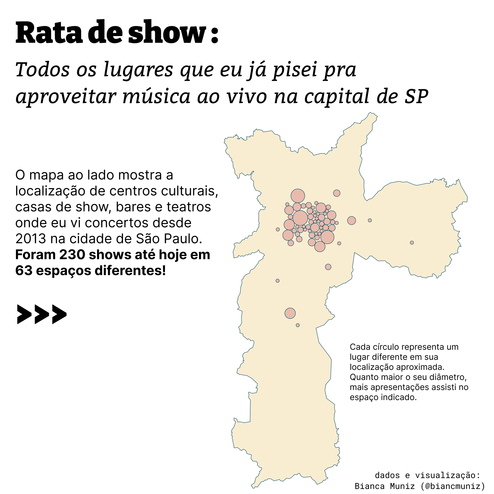
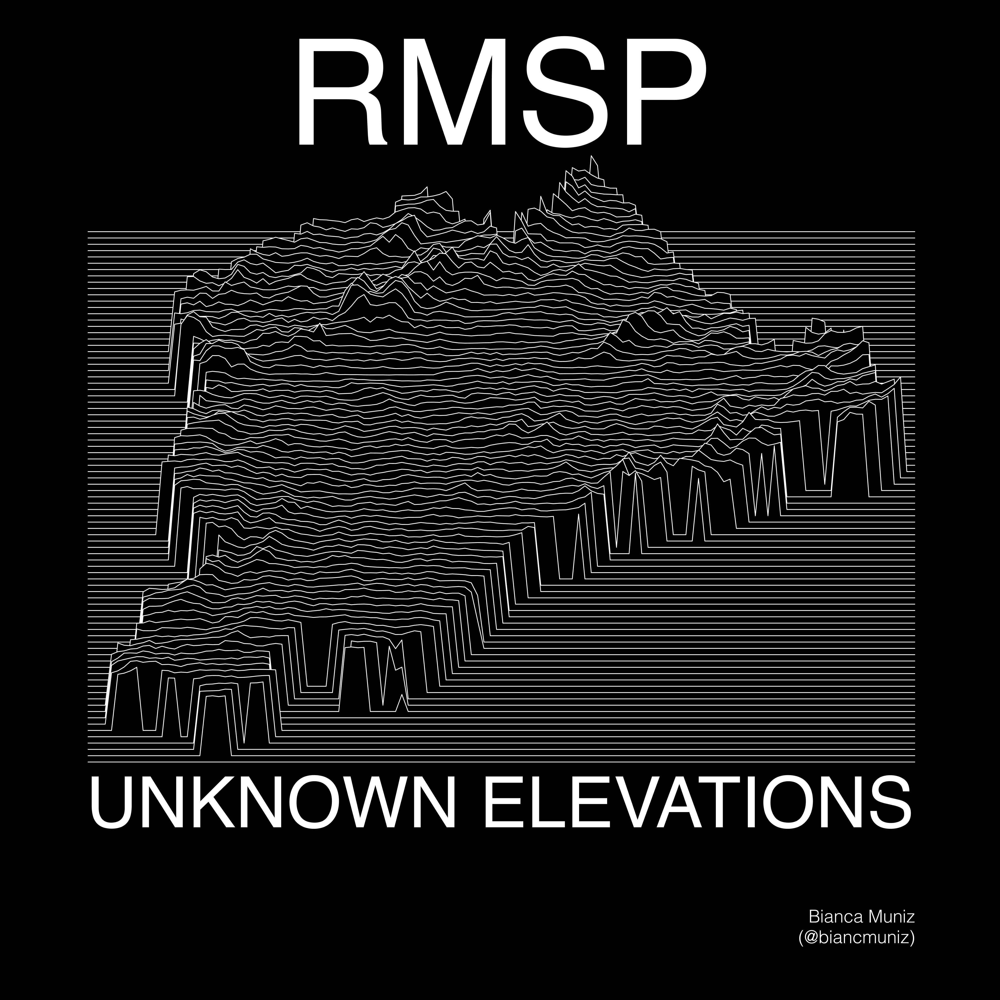
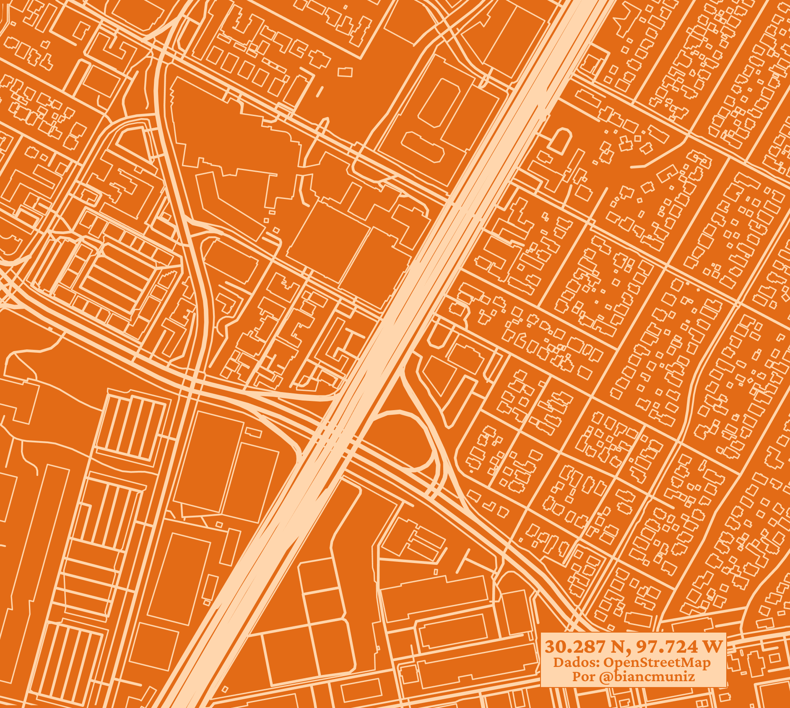
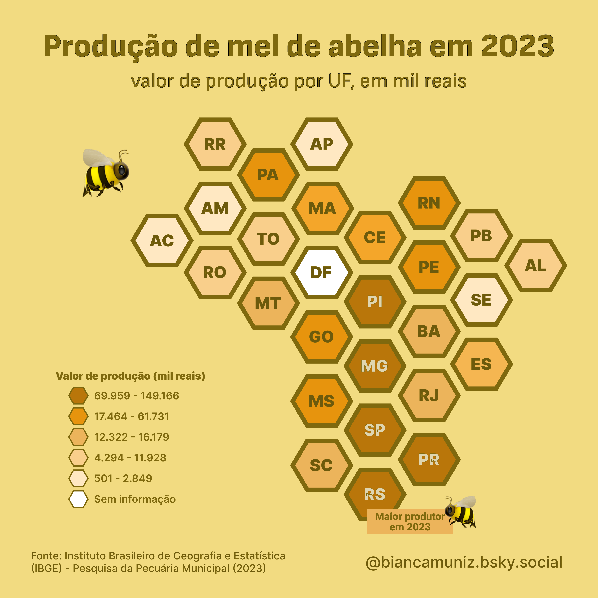

# Códigos, dados e mapas do 30DayMapChallenge de 2024
## Por Bianca Muniz

## Dia 1: Pontos

[código](code/01_points.R) | [mapa (html)](plots/01-points.html) | [mapa (gif)](plots/01-points.gif)

## Dia 2: Linhas

[código](code/02_lines.R) | [mapa](plots/02_lines.png)

## Dia 3: Polígonos

[código](code/03_polygons.R) | [mapa](plots/03_polygons.svg)

## Dia 4: Hexágonos

sem código porque fiz no Figma :D

## Dia 5: Uma jornada

[código](code/05_a_journey.R) | [mapa](plots/05_a_journey.png)
