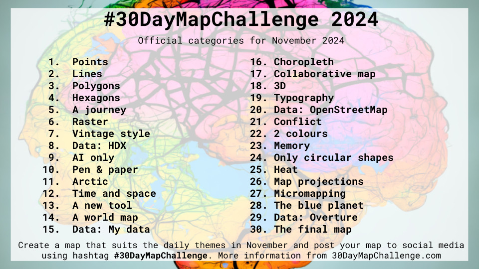
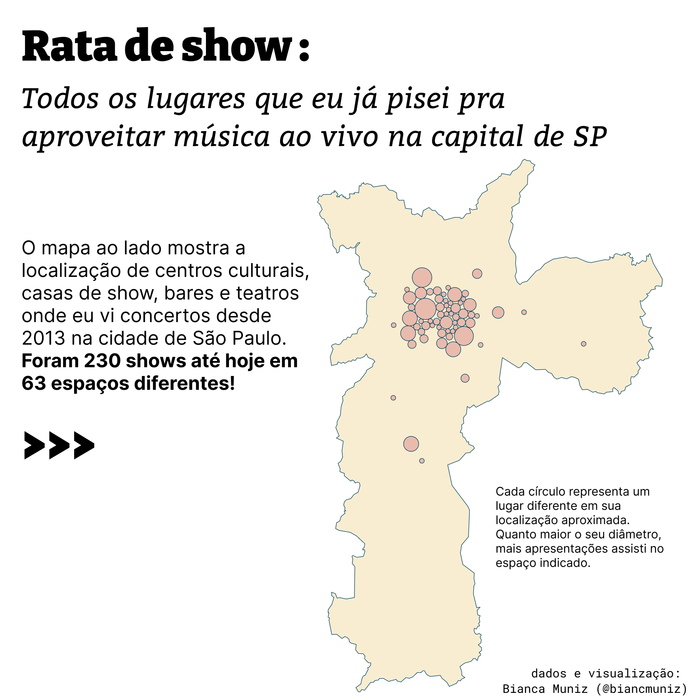
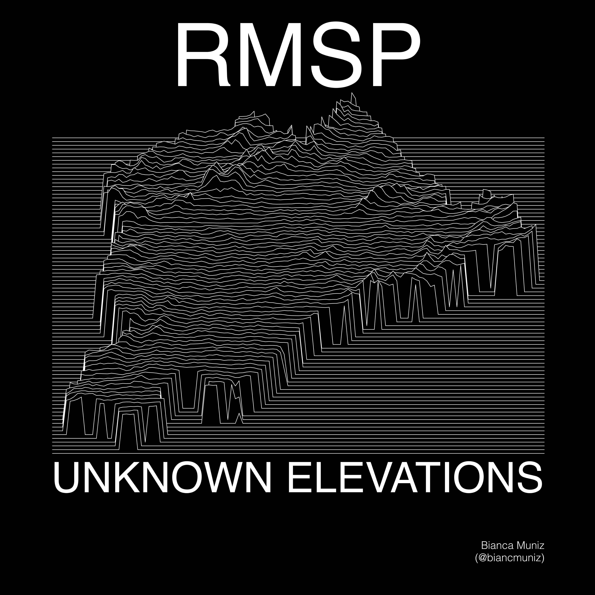
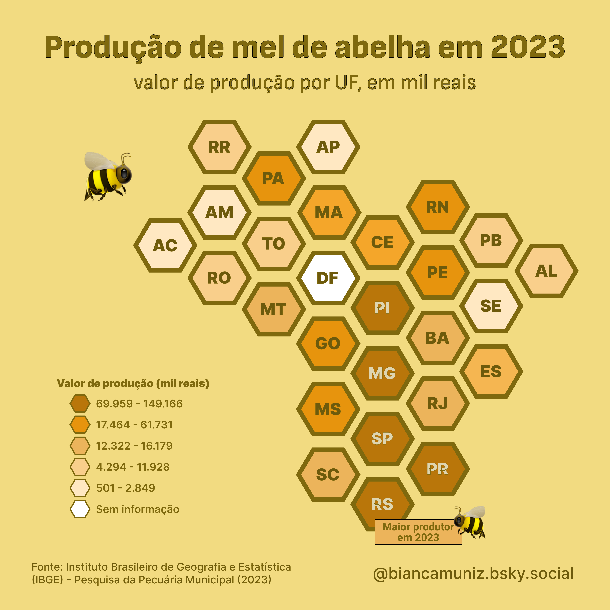
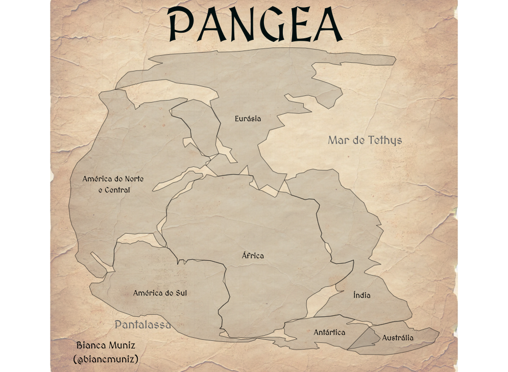
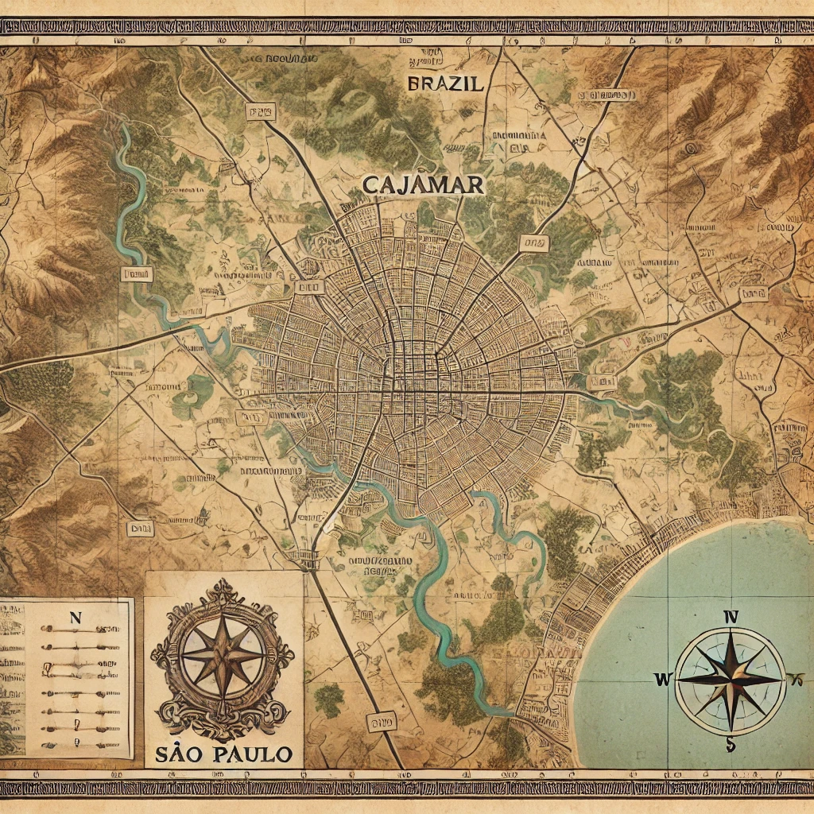
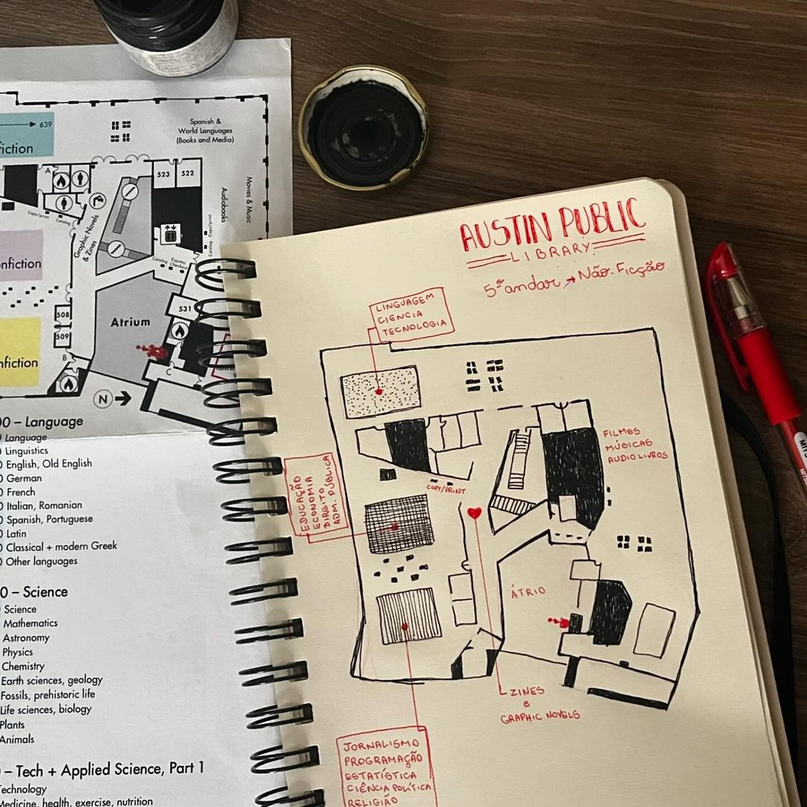

# Códigos, dados e mapas do 30DayMapChallenge de 2024
## Por Bianca Muniz

## 1: Pontos

[código](code/01_points.R) | [viz](plots/day01/)

## 2: Linhas

[código](code/02_lines.R) | [viz](plots/day02/)

## 3: Polígonos

[código](code/03_polygons.R) | [viz](plots/day03/)

## 4: Hexágonos

sem código porque fiz no Figma :D

## 5: Uma jornada

[código](code/05_a_journey.R) | [viz](plots/day05/)
## 6: Raster
...

## 7: Vintage

## 8: Dados: HDX

[código](code/08_hdx.R) | [mapa](plots/day08/)

## 9: Inteligência Artificial

[prompt](https://chatgpt.com/share/67439531-8d80-8010-9134-da52b28a852a) | horrível, Cajamar-vintage-freestyle

## 10: Papel e caneta

## 11: Ártico
...

## 12: Tempo e espaço
...

## 13: Uma nova ferramenta
...

## 14: Um mapa mundial (mapa-múndi?)
...

## 15: Meus dados
...

## 16: Mapa coroplético 
...

## 17: Mapa colaborativo 
...

## 18: 3D 
...

## 19: Tipografia 
...

## 20: Dados: OpenStreetMap

[código](code/20_osm.R) | [mapa](plots/day20/)

## 21: Conflito 
...

## 22: Duas cores 
...

## 23: Memória
...

## 24: Somente círculos 
...

## 25: Calor
...

## 26: Projeções
...

## 27: Micromapping
...

## 28: Planeta azul
...

## 29: Dados: Overture
...

## 30: Mapa final
...

